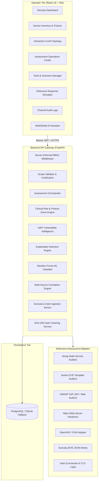

# MediShield — IoMT Security & Privacy Platform (v2.0 Upgrade)

> **Academic Cybersecurity Research Prototype & Hackathon Demonstration Platform**  
> An integrated defensive security operations platform for the Internet of Medical Things (IoMT). Provides real-time asset posture monitoring, explainable rule-based intrusion detection, authentic machine learning attack classification, authorized vulnerability assessment orchestration (Nmap, Nuclei, ZAP, Nikto, OpenVAS), passive IDS ingestion (Suricata, Zeek, Tshark), cryptographic SHA-256 audit hash chaining, and interactive defensive containment simulation.

---

## 1. Defensive Security & Ethical Safety Mandate

MediShield is strictly a **DEFENSIVE SECURITY PLATFORM** designed for hospital IoMT asset protection and educational research:
- **Authorized Bounded Scope**: Security tools and assessments operate **only** against devices explicitly registered in MediShield inventory within operator-signed, time-limited scope certificates. Arbitrary internet scanning is strictly blocked at the backend.
- **Strictly Non-Destructive**: Automated exploitation, credential cracking, denial-of-service testing, medical-device shutdown, medication alteration, and real-world hardware containment are **prohibited**.
- **Transparent Simulation**: All incident response containment actions remain simulated within a virtual testbed with unmistakable indicators:
  > `"AUTHORIZED SECURITY ASSESSMENT ONLY • SIMULATION — NO REAL DEVICE CONTROL"`

---

## 2. Core Architecture & System Map



---

## 3. Technology Stack

- **Frontend Tier**:
  - React 18 SPA built with Vite
  - Tailwind CSS with hospital dark mode theme
  - Recharts for live time-series vitals & vulnerability distributions
  - Lucide React iconography
- **Backend API Gateway**:
  - Python 3.11 with FastAPI (asynchronous ASGI framework)
  - Pydantic v2 schemas for strict input validation
  - Python `cryptography` library for AES-256-GCM authenticated encryption
  - SHA-256 cryptographic hash chaining for tamper-evident audit logs
- **Persistence Tier**:
  - Relational PostgreSQL / Supabase schema (with automatic local SQLite fallback for offline execution)
  - SQLAlchemy 2.0 ORM with 11 relational models & dynamic column auto-migration
- **Machine Learning Subsystem**:
  - scikit-learn (Random Forest classifier trained on UNB CICIoMT2024 dataset)
  - Medians imputation and robust scaling with zero feature leakage
- **Testing & Quality Assurance**:
  - 19 automated pytest integration tests passing with 100% success
  - Production Vite build verified

---

## 4. Key Functional Features (Phases 0 to 34)

| Feature | Description | Implementation |
|---|---|---|
| **IoMT Asset Inventory** | Hospital hardware inventory (Philips ECG, Medtronic Ventilator, Baxter Infusion, Dexcom CGM) with manufacturer, model, clinical department, and security posture score. | `DeviceModel`, `DeviceInventoryPage.jsx`, `DeviceDetailPage.jsx` |
| **Assessment Scope Engine** | Bounded, audited authorization certificates required before running any security tool. Prevents arbitrary host targeting. | `ScopeValidator`, `AssessmentScopeModel`, `assessments.py` |
| **Tool Orchestration** | Unified multi-tool scanner coordinator (Nmap, Nuclei, ZAP, Nikto, OpenVAS) with native subprocess execution and faithful synthetic IoMT fallback. | `AssessmentOrchestrator`, `BaseScannerAdapter`, `AssessmentCenterPage.jsx` |
| **Clinical Risk Engine** | Transparent posture scoring taking into account device criticality (Ventilator = 1.5x, Infusion = 1.3x) and department weighting (ICU = 1.3x). | `RiskEngine`, `VulnerabilityIntelligenceService` |
| **Passive IDS Ingestion** | Normalizes Suricata EVE JSON alerts and Zeek connection anomalies into real-time security events. | `IDSManager`, `ids_service.py`, `POST /api/detection/ids/ingest` |
| **Multi-Source Correlation** | Detects multi-stage attack chains (e.g. Port Scan + DoS flood = Critical Penetration Incident) and raises coordinated incident tickets. | `CorrelationEngine`, `POST /api/incidents/correlate/{id}` |
| **Network Topology Map** | Visual map of clinical VLANs (`ICU_VLAN_10`, `WARD_VLAN_20`, `ER_VLAN_30`, `AMBULATORY_VLAN_40`, `CORE_VLAN_1`) with real-time status glows. | `NetworkTopologyPage.jsx` |
| **Containment Simulator** | Tests defensive microsegmentation playbooks (VLAN 99 quarantine, ingress rate-limiting, session revocation). | `ResponseSimulatorPage.jsx` |
| **SHA-256 Audit Hash Chain** | Cryptographically links each audit log entry to its predecessor using SHA-256, enabling instant tamper verification. | `AuditChainService`, `GET /api/audit-logs/verify-chain`, `AuditLogsPage.jsx` |
| **MediShield AI Assistant** | Grounded clinical cybersecurity chatbot with defensive safety guardrails. | `AIAssistantWidget.jsx` |

---

## 5. Localhost Run & Setup Instructions

### Prerequisites
- Python 3.11+
- Node.js 18+ & npm

### Backend Setup
```bash
cd backend
python -m venv .venv
.\.venv\Scripts\activate  # On Linux/macOS: source .venv/bin/activate
pip install -r requirements.txt
uvicorn app.main:app --host 127.0.0.1 --port 8000
```
- API Documentation (Swagger UI): `http://127.0.0.1:8000/docs`
- Health check: `http://127.0.0.1:8000/api/health`

### Frontend Setup
```bash
cd frontend
npm install
npm run dev -- --host 127.0.0.1 --port 5173
```
- Open browser at: `http://127.0.0.1:5173`

### Demo Credentials (Role-Based Access Control)
- **Administrator**: `admin@medishield.local` / `adminpassword123` (Full system access, policy configuration, device registration)
- **Security Analyst**: `analyst@medishield.local` / `analystpassword123` (Assessment scope creation, scan execution, incident triage, quarantine)
- **Doctor Demo**: `doctor@medishield.local` / `doctorpassword123` (Read-only clinical telemetry; restricted from administrative and audit features)

---

## 6. Automated Testing & Verification

Run the complete automated backend integration test suite:
```bash
cd backend
pytest -v
```
**Results**:
- 19 passed integration tests covering authentication, RBAC, scope validation, multi-tool execution, passive IDS ingestion, event correlation, detection policies, and SHA-256 audit hash chain verification.

Build the frontend for production:
```bash
cd frontend
npm run build
```
**Results**:
- 0 lint errors, 2301 transformed modules, production bundle compiled cleanly in `dist/`.

---

## 7. College Project & Hackathon Demonstration Script

1. **Step 1: Role-Based Access Control**  
   Log in as `Doctor Demo`. Demonstrate that clinical vitals can be viewed, but administrative actions, policies, and audit logs are securely blocked with server-side 403 Forbidden. Then log in as `Security Analyst`.
2. **Step 2: Device Inventory & Hardware Posture**  
   Navigate to **Device Inventory**. Show the 5 realistic IoMT assets with real hospital manufacturers (Philips, Medtronic, Baxter, Dexcom) and their current Security Posture Scores.
3. **Step 3: Network Topology & VLAN Microsegmentation**  
   Open **Network Topology**. Show the interactive microsegmentation map dividing devices across ICU, General Ward, ER, and Outpatient VLANs.
4. **Step 4: Authorize & Launch an Assessment**  
   Go to **Assessment Center**. Authorize a new scope certificate for `DEV-VENT-502` (`192.168.10.52`). Select `Nmap` and `Nuclei`. Click **Execute Assessment Now**. Show live scan results, normalized findings (Modbus unauthenticated exposure, diagnostic memory leak), and clinical posture score deduction.
5. **Step 5: Multi-Source Attack Correlation**  
   Trigger simulated traffic spike on the ventilator. Demonstrate how the **Correlation Engine** links the reconnaissance finding with the volumetric traffic flood to create a coordinated `Multi-Stage Penetration Attack` incident ticket.
6. **Step 6: Defensive Containment Simulator**  
   Navigate to **Response Simulator**. Trigger `Quarantine Switch Port (VLAN 99 Microsegmentation)`. Show the safety banner, simulated VLAN isolation state, and zero disruption to simulated patient life support.
7. **Step 7: Cryptographic SHA-256 Audit Hash Chain Verification**  
   Go to **Audit Logs**. Click **Verify Cryptographic Hash Chain**. Watch the system verify the unbroken SHA-256 chain across all logged events, confirming tamper-evident forensic compliance.
8. **Step 8: MediShield AI Assistant**  
   Click the **MediShield AI Assistant** button at the bottom-right. Ask questions about ventilator Modbus hardening or infusion pump security. Try an offensive prompt to demonstrate defensive safety guardrails in action.
