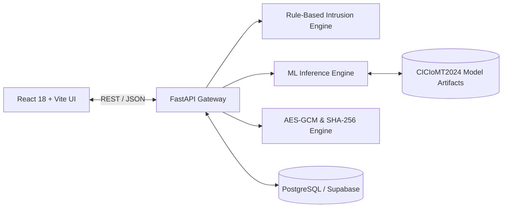

# MediShield — IoMT Security & Privacy Platform

> **Academic Cybersecurity Research Prototype**  
> An integrated platform for Internet of Medical Things (IoMT) security monitoring, explainable intrusion detection, machine learning classification, role-based access control, and cryptographic data integrity verification.

---

## 1. Project Background & Problem Statement

The Internet of Medical Things (IoMT) connects smart medical equipment—such as ECG monitors, infusion pumps, continuous glucose monitors, and bedside patient monitoring stations—to hospital networks. While these technologies revolutionize healthcare delivery, they introduce critical cybersecurity vulnerabilities:
- Unauthorized device discovery and lateral movement.
- High-frequency brute-force authentication attacks.
- Device spoofing and impersonation.
- Denial of Service (DoS/DDoS) disrupting life-critical telemetry streams.
- Unencrypted wireless telemetry and silent data tampering.

**MediShield** demonstrates how proactive telemetry monitoring, deterministic rule-based intrusion detection, authentic machine learning inference (trained on UNB's **CICIoMT2024** dataset), server-enforced RBAC, authenticated encryption (AES-256-GCM), and SHA-256 data integrity auditing can be unified into an operator-grade security dashboard.

---

## 2. Technology Stack

- **Frontend**: React 18, Vite, Tailwind CSS, Recharts, Lucide React.
- **Backend**: Python 3.11, FastAPI, Pydantic v2, Uvicorn, Python Cryptography (`cryptography`).
- **Database**: PostgreSQL (managed with Supabase).
- **Machine Learning**: scikit-learn, pandas, numpy, joblib (CICIoMT2024 dataset).
- **Testing**: pytest, FastAPI TestClient, Vite build verification.

---

## 3. Project Architecture



---

## 4. Current Phase Status

| Phase | Description | Status |
|---|---|---|
| **Phase 1** | **Project Planning and Initial Setup** | **Completed** |
| Phase 2 | Frontend Design and Dashboard | Awaiting Approval |
| Phase 3 | Backend API and Database Integration | Pending |
| Phase 4 | Authentication and Role-Based Access Control | Pending |
| Phase 5 | Rule-Based Intrusion Detection | Pending |
| Phase 6 | Machine Learning Intrusion Detection | Pending |
| Phase 7 | Privacy, Encryption, and Data Integrity | Pending |
| Phase 8 | Incident Management, Audit Logs, and Reports | Pending |
| Phase 9 | Full Integration, Testing, and Debugging | Pending |
| Phase 10 | Deployment, Documentation, and Final Demonstration | Pending |

---

## 5. Quick Start Instructions

### 5.1 Backend Setup
```bash
cd backend
# Create virtual environment (Python 3.11)
py -3.11 -m venv .venv
.\.venv\Scripts\Activate.ps1

# Install dependencies
pip install -r requirements.txt

# Start backend server
uvicorn app.main:app --reload --host 127.0.0.1 --port 8000
```
- API Health Status: [http://127.0.0.1:8000/api/health](http://127.0.0.1:8000/api/health)
- Interactive OpenAPI Docs: [http://127.0.0.1:8000/docs](http://127.0.0.1:8000/docs)

### 5.2 Frontend Setup
```bash
cd frontend
# Install npm dependencies
npm install

# Run Vite development server
npm run dev
```
- Dashboard Interface: [http://127.0.0.1:5173](http://127.0.0.1:5173)

### 5.3 Automated Tests
```bash
cd backend
pytest -v
```

---

## 6. Scope & Research Notice

MediShield is an academic research prototype utilizing synthetic medical device data. It is not a certified medical device, does not connect to real clinical devices, and must not be used for medical decisions. Detailed limitations are documented in [`docs/limitations.md`](docs/limitations.md).
