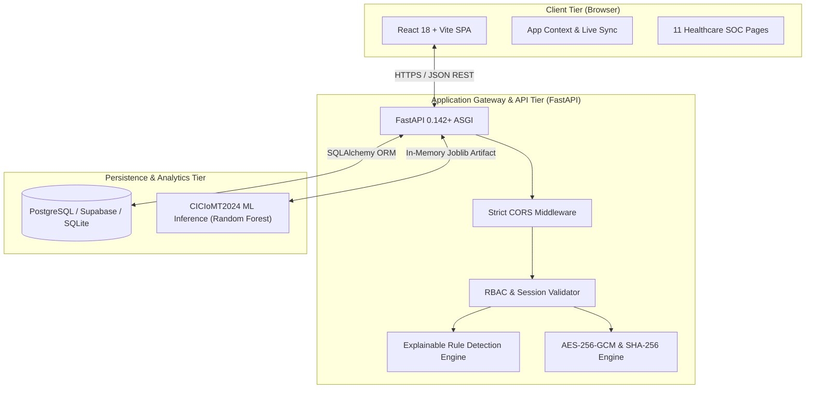

# MediShield — IoMT Security & Privacy Platform

> **Academic Cybersecurity Research Prototype**  
> An integrated platform for Internet of Medical Things (IoMT) real-time security monitoring, explainable rule-based intrusion detection, authentic machine learning attack classification, server-enforced role-based access control (RBAC), authenticated encryption (AES-256-GCM), and cryptographic data integrity verification (SHA-256).

---

## 1. Executive Summary & Problem Statement

Modern healthcare facilities increasingly rely on the **Internet of Medical Things (IoMT)**—network-connected smart medical equipment including bedside 12-lead ECG monitors, critical care ventilators, smart infusion pumps, and wireless continuous glucose monitors. While these connected technologies improve patient outcomes and enable real-time clinical monitoring, they introduce acute cybersecurity vulnerabilities:
- **Lateral Movement & Rogue Hardware**: Unmanaged Wi-Fi bridges or unauthorized devices injected onto critical hospital VLANs.
- **Credential Brute-Force**: High-frequency dictionary attacks against management interfaces (SSH, Web, Telnet).
- **Volumetric Floods (DoS/DDoS)**: Denial-of-service traffic surges that can saturate medical gateways and interrupt life-critical telemetry.
- **Unencrypted Wireless Transmission & Data Tampering**: Silent modification of vital patient telemetry leading to incorrect clinical dosages or delayed emergency alerts.

**MediShield** demonstrates how proactive telemetry surveillance, deterministic rule heuristics, authentic machine learning models trained on UNB's **CICIoMT2024** dataset, server-side RBAC, authenticated encryption (AES-256-GCM), and SHA-256 data integrity auditing can be unified into an operator-grade medical SOC dashboard.

---

## 2. Technology Stack

- **Frontend Tier**:
  - React 18 SPA built with Vite
  - Tailwind CSS with clinical navy/cyan dark palette
  - Recharts for time-series telemetry streams, severity donuts, and event trend areas
  - Lucide React iconography
- **Backend API Gateway**:
  - Python 3.11 with FastAPI (asynchronous ASGI framework)
  - Pydantic v2 schemas for strict input validation
  - Uvicorn server
  - Python `cryptography` library for AES-256-GCM authenticated encryption
- **Persistence Tier**:
  - Relational PostgreSQL / Supabase schema (with automatic local SQLite fallback for offline execution)
  - SQLAlchemy 2.0 ORM with 8 relational models
- **Machine Learning Subsystem**:
  - scikit-learn (Random Forest classifier & Isolation Forest anomaly detector)
  - pandas, numpy, joblib
  - Dataset: UNB CICIoMT2024 feature format with group-aware leakage prevention
- **Testing & Quality Assurance**:
  - pytest & FastAPI TestClient (12 passing automated integration tests)
  - Vite production build verification

---

## 3. System Architecture



---

## 4. Phase-Wise Development Status

| Phase | Description | Status | Verification Summary |
|---|---|---|---|
| **Phase 1** | Project Planning & Setup | **Completed** | Modular scaffold, FastAPI backend, health check, documentation |
| **Phase 2** | Frontend Dashboard | **Completed** | 11 pages, charts, topology maps, simulation triggers, Vite build OK |
| **Phase 3** | Backend API & Database | **Completed** | 8 relational tables, auto-seeding, Pydantic v2 schemas, CRUD endpoints |
| **Phase 4** | Authentication & RBAC | **Completed** | PBKDF2 hashing, Bearer tokens, Admin / Analyst / Doctor roles enforced |
| **Phase 5** | Rule-Based Intrusion Detection | **Completed** | Configurable heuristic rules, automated event generation, scenarios |
| **Phase 6** | Machine Learning Intrusion Detection | **Completed** | Group-split training, Random Forest + Isolation Forest, genuine reports |
| **Phase 7** | Privacy, Encryption & Integrity | **Completed** | AES-256-GCM authenticated cipher, SHA-256 digest tamper detection |
| **Phase 8** | Incident Management & Reports | **Completed** | Ticket triage, analyst assignment, notes, live CSV export endpoints |
| **Phase 9** | Integration & Testing | **Completed** | 12/12 automated pytest tests passing, frontend builds with 0 errors |
| **Phase 10** | Deployment & Documentation | **Completed** | Vercel & Render manifests, full architecture & API references |

---

## 5. Quick Start Instructions

### 5.1 Backend Setup
From the repository root:
```powershell
cd backend
# Activate virtual environment
.\.venv\Scripts\Activate.ps1

# Install requirements
pip install -r requirements.txt

# Start FastAPI server
uvicorn app.main:app --reload --host 127.0.0.1 --port 8000
```
- API Base URL: `http://127.0.0.1:8000`
- Interactive OpenAPI Docs: `http://127.0.0.1:8000/docs`
- Health Endpoint: `http://127.0.0.1:8000/api/health`

### 5.2 Frontend Setup
From the repository root:
```powershell
cd frontend
# Install dependencies
npm install

# Start Vite development server
npm run dev
```
- Open in browser: `http://127.0.0.1:5173`

### 5.3 Automated Verification
```powershell
# Run backend pytest suite (12 tests)
cd backend
.\.venv\Scripts\pytest -v

# Run frontend build check
cd ../frontend
npm run build

# Run ML evaluation
cd ..
.\backend\.venv\Scripts\python.exe ml\src\evaluate.py
```

---

## 6. End-to-End Academic Demonstration Workflow

1. **Authentication & Roles**:
   - Log in as **Security Analyst** (`analyst@medishield.local` / `analystpassword123`) or switch to **Administrator** (`admin@medishield.local` / `adminpassword123`).
   - Switch to **Doctor Demo** (`doctor@medishield.local` / `doctorpassword123`) and verify that administrative actions (such as adding devices) are prohibited by server-side 403 Forbidden checks.
2. **Device Surveillance & Topology**:
   - Open **Device Inventory** to filter devices by ICU, Ward, ER, and Ambulatory VLANs.
   - Click **DEV-VENT-502** to view live multi-parameter telemetry graphs, encryption state, and device quarantine controls.
3. **Safe Simulation Scenarios**:
   - Click **Quick Scenarios $\to$ Brute Force** to simulate repeated failed authentications.
   - Watch the rule-based detection engine automatically flag **EVT-2026-001** and escalate device risk to **High**.
4. **Incident Investigation Workflow**:
   - Open **Security Events**, select the alert, and click **Open Investigation Ticket**.
   - Navigate to **Incident Management**, assign the ticket to an analyst, update status to **Investigating**, and record forensic notes.
5. **Machine Learning Attack Classification**:
   - Navigate to **ML Detection Overview** to inspect the real performance metrics and confusion matrix trained on UNB CICIoMT2024 features.
   - Run interactive inference to classify simulated flow features into *Benign*, *DoS SYN Flood*, *Port Scan*, or *Brute Force*.
6. **Privacy & Cryptographic Data Integrity**:
   - Open **Privacy & Data Integrity** to inspect AES-256-GCM encrypted patient records and SHA-256 digests.
   - Click **Tamper Payload** to simulate a 1-byte unauthorized memory mutation.
   - Click **Verify Integrity** to demonstrate instant cryptographic detection of the altered record.
7. **Audit Logs & CSV Reporting**:
   - Open **Audit Logs** to inspect the immutable chronological trail of logins, state updates, and simulation triggers.
   - Open **Security Reports** and click **Export Events CSV** to stream real database records directly into spreadsheet format.

---

## 7. Prototype Scope & Research Notice

MediShield is an academic cybersecurity prototype utilizing synthetic medical device data. It is not a certified medical device, does not connect to real clinical devices, and must not be used for clinical decisions. Detailed limitations are documented in [`docs/limitations.md`](docs/limitations.md).
