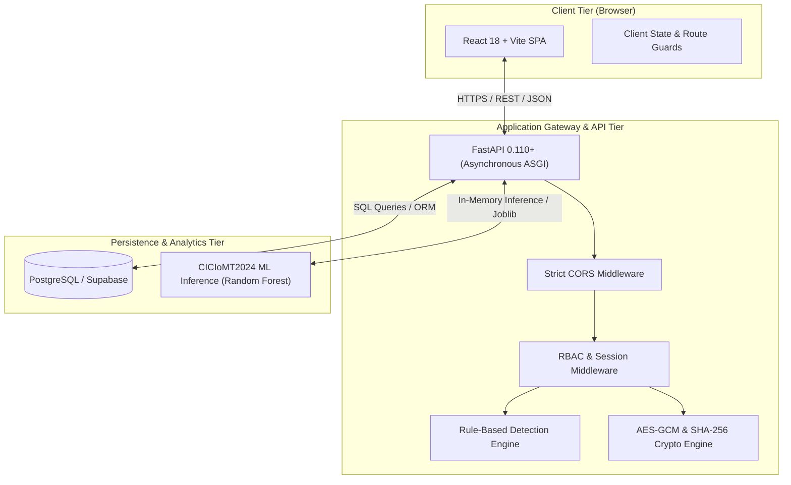
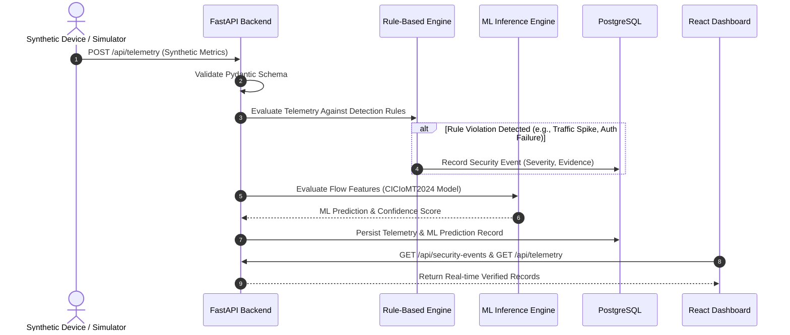
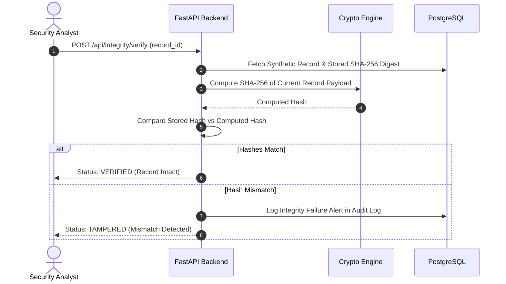

# MediShield — Proposed System Architecture

## 1. Executive Overview

MediShield is an academic IoMT (Internet of Medical Things) cybersecurity and privacy research prototype. It provides real-time security monitoring, deterministic rule-based intrusion detection, genuine machine learning attack classification, authenticated encryption (AES-GCM), cryptographic data integrity verification (SHA-256), and incident investigation management.

---

## 2. Component Responsibilities

### 2.1 Frontend Tier (`/frontend`)
- **Technology**: React 18, Vite, Tailwind CSS, Recharts, Lucide React.
- **Responsibilities**:
  - Render an intuitive medical cybersecurity dashboard (dark navy palette with clinical status accents).
  - Visualize simulated IoMT telemetry (heart rate, glucose, SPO2, infusion rates) and network metrics.
  - Present security events, rule violations, and incident response queues.
  - Provide interactive safe simulation controls to trigger security anomalies for academic demonstration.
  - Display ML model performance metrics, dataset provenance, and honest confusion matrices without exaggeration.
  - Enforce visual role-based UI access based on server-verified session claims.

### 2.2 Backend API Tier (`/backend`)
- **Technology**: Python 3.11, FastAPI, Pydantic v2, Uvicorn.
- **Responsibilities**:
  - Deliver structured, asynchronous RESTful endpoints under `/api`.
  - Validate all input payloads strictly with Pydantic v2 schemas.
  - Server-side Role-Based Access Control (RBAC) across three distinct personas:
    1. **Administrator**: Full device inventory, user configuration, audit log inspection.
    2. **Security Analyst**: Security event inspection, incident triage, ML evaluation, report exports.
    3. **Doctor Demo Role**: Restricted synthetic patient/device telemetry view; no security admin access.
  - Execute deterministic detection rules across synthetic device telemetry streams.
  - Interface with the machine learning pipeline for IoMT attack classification.
  - Provide authenticated encryption (AES-256-GCM) and integrity computation (SHA-256) services.
  - Maintain immutable audit log trails for sensitive actions and administrative changes.

### 2.3 Database & Storage Tier (`/database`)
- **Technology**: PostgreSQL (managed via Supabase).
- **Responsibilities**:
  - Relational persistence of simulated medical devices, device telemetry, security events, incidents, integrity verification logs, audit logs, and user profiles.
  - Enforce foreign keys, unique constraints, check constraints, and indexing on lookup fields (e.g., `device_id`, `timestamp`, `severity`).
  - Maintain auditability by timestamping all state transitions.

### 2.4 Machine Learning Engine (`/ml`)
- **Technology**: scikit-learn, pandas, numpy, joblib.
- **Responsibilities**:
  - Ingest genuine IoMT network traffic data (using UNB's **CICIoMT2024** dataset).
  - Execute reproducible preprocessing: feature selection, handling missing values, encoding labels, and group-aware splitting to avoid cross-device data leakage.
  - Train an explainable classifier (Random Forest) and anomaly detector.
  - Output genuine, verifiable evaluation metrics (Precision, Recall, F1, Confusion Matrix).
  - Serve predictions to the backend inference service with model versioning, feature verification, and confidence scores.

### 2.5 Cryptographic & Privacy Subsystem
- **Technology**: Python `cryptography` library.
- **Responsibilities**:
  - Encrypt synthetic sensitive records using AES-GCM (Galois/Counter Mode) with unique 96-bit nonces per encryption operation.
  - Compute SHA-256 cryptographic digests for synthetic telemetry and exported reports to demonstrate tamper-detection.
  - Strictly isolate encryption keys in server-side environment variables (`.env`), never transmitting them to clients or storing them plaintext in databases.

---

## 3. Data Flow Architecture

### 3.1 Device Telemetry & Intrusion Detection Flow

### 3.2 Data Integrity Verification & Tampering Demonstration

---

## 4. Security Principles & Architecture Controls

1. **Defense in Depth**: Authorization checks are applied at the route handler level via FastAPI dependencies, never relying on UI visibility toggles.
2. **Deterministic vs. Probabilistic Clear Separation**:
   - Deterministic rule alerts (e.g., failed logins >= 5, unexpected offline) are labeled as **Security Events**.
   - Machine learning outputs are labeled as **ML Classifications with Confidence Scores**, acknowledging model error bounds.
3. **Auditability**: Every critical state transition (incident status, role change, key verification, scenario trigger) creates an append-only audit log entry.
4. **Zero Production Assumptions**: All medical data is explicitly generated synthetic test vectors; no actual clinical patient records or real devices are used.
